# JAVA Shooting game

## Project purpose

What this project is trying to implement is a shooting game that can be played by two people. Through the GUI, each player can see and move his character and operate it through keyboard input.

***

## Keyboard input manual

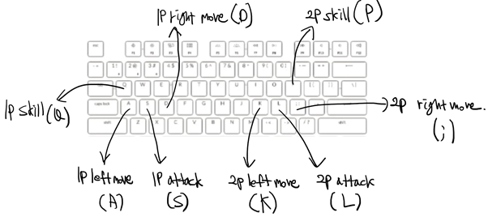

***

## Screenshots for each screen with brief description

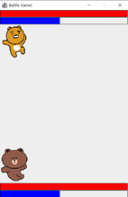

There are two players, and they can move and attack each other.

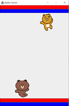

Each player can move left and right.

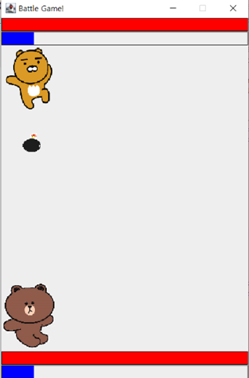

The basic attack of each player is to blow a bomb.

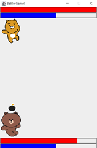

When hit by a bomb, the player's life value decreases.

Each player has a mana, and when the mana is all full, the skill can be used.
If you use the skill, the mana gradually decreases, and when the mana becomes zero, the skill is unactivated. The skills of the two players are different.

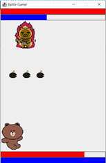

The player on the top has skill to fly three bombs in the event of an attack.

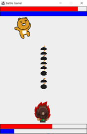

The player on the bottom has skill to speed up movement and attack.

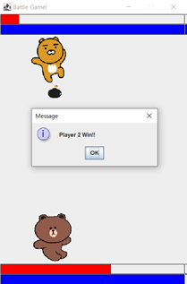

When a player's life value reaches zero, the opponent wins and the game ends.

***

## Code of the main functionalities and description

```java
bufGrp.setColor(Color.BLACK);
bufGrp.drawRect(8, 30, 383, 20);
bufGrp.setColor(Color.RED);
bufGrp.fillRect(9, 31, 382 * info.player1.life / 100, 19);

bufGrp.setColor(Color.BLACK);
bufGrp.drawRect(8, 52, 383, 20);
bufGrp.setColor(Color.BLUE);
bufGrp.fillRect(9, 53, 382 * info.player1.mana / 100, 19);
```

The player's life value and mana bar is implemented as above.
It is implemented in a way that draws a rectangle as red as the percentage of current life value.

```java
// Check whether the x-axis interval or the y-axis interval overlaps.
public boolean collision(int x, int y, int w, int h) {
	if ( (x+w < pos_x || pos_x + width < x) || (y+h < pos_y || pos_y + height < y) ) {
		return false;
	}
	return true;
}
```

Collision check is implemented as above.
pos_x is my x coordinate, x is the x coordinate of the counterpart, and w is the width of the counterpart.

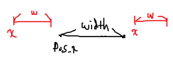

If the x-coordinates do not overlap, they must be shown as above, so that they are expressed in code x+w < pos_x || pos_x + width <x.
If the x-coordinates do not overlap or the y-coordinates do not overlap, the object does not overlap, or a collision occurs.

```java
// loop using iterator, since it can be removed according to condition
Iterator<AttackUnit> it = info.attackUnits.iterator()
while (it.hasNext()) {
	AttackUnit unit = it.next();
	bufGrp.drawImage(unit.img, unit.pos_x, unit.pos_y, unit.width, unit.height, this)
// If there's a collision, reduce the life of player and remove the attacking unit.
	if (info.player1.collision(unit.pos_x, unit.pos_y, unit.width, unit.height)) {
		info.player1.life -= unit.damage;
		it.remove();
    }
}
```

iterating all existing bombs, if a collision occurs with the player, it reduces the player's life value and disappears.

```java
// If it is out of area, remove it.
if (unit.pos_y < 0 || unit.pos_y > 600) {
	it.remove();
}
```

When the bomb goes out of the area, it disappears.

```java
@Override
public void defaultAttack() {
	if (skillActivated == false) {
		AttackUnit myAttack = new AttackUnit(pos_x + 30, pos_y + 105, 0, 1, 1);
		info.attackUnits.add(myAttack);
	}
}
```

When a player conducts an attack, it creates a bomb in front of the player.

```java
@Override
public void keyPressed(KeyEvent e) {
	int code = e.getKeyCode();

	if (code == KeyEvent.VK_A) {
		is_A_pressed = true;
	}
	else if (code == KeyEvent.VK_D) {
		is_D_pressed = true;
	}
	else if (code == KeyEvent.VK_K) {
		is_K_pressed = true;
	}
	else if (code == KeyEvent.VK_SEMICOLON) {
		is_SEMICOLON_pressed = true;
	}
}

@Override
public void keyReleased(KeyEvent e) {
	int code = e.getKeyCode();

	if (code == KeyEvent.VK_A) {
		is_A_pressed = false;
	}
	else if (code == KeyEvent.VK_D) {
		is_D_pressed = false;
	}
	else if (code == KeyEvent.VK_K) {
		is_K_pressed = false;
	}
	else if (code == KeyEvent.VK_SEMICOLON) {
		is_SEMICOLON_pressed = false;
	}
}
```

As the key is pressed and released, the boolean variable is changed.

```java
if (is_A_pressed) {
	info.player1.pos_x = Math.max(0, info.player1.pos_x - info.player1.speed);
}
if (is_D_pressed) {
	info.player1.pos_x = Math.min(320, info.player1.pos_x + info.player1.speed);
}
if (is_K_pressed) {
	info.player2.pos_x = Math.max(0, info.player2.pos_x - info.player2.speed);
}
if (is_SEMICOLON_pressed) {
	info.player2.pos_x = Math.min(320, info.player2.pos_x + info.player2.speed);
}
```

If the key is pressed, move the character.

***

## Description of what is included in project

### Class structure

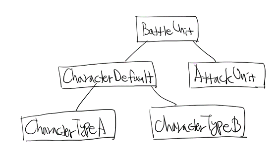

Most basically, there is a BattleUnit class. This class has x-coordinates, y-coordinates, width, and height, which are common information of all objects appearing in the game.

And Attack Unit, which represents the character's attack object, inherits Battle Unit. This class additionally has movement speed, movement direction, and damage information.

The CharacterDefault class is an abstract class representing the most basic type of character. This class has life, mana, movement speed, attack speed, attack method, and skill method.

Each character type inherits CharacterDefault, It has its own attack methods and skill methods.

```java
public class BattleControl extends KeyAdapter implements Runnable {
…
	@Override
	public void run() {
		try {
			while (true) {
				modify();
				Thread.sleep(5);
			}
		} catch (Exception e) {}
	}
}
```

Thread the key-pressing interface and check it for a short interval to move the character and bomb.

### File I/O

```java
if (info.player1.life == 0) {
    try {
        FileWriter writer = new FileWriter(file, true);
        writer.write(LocalDateTime.now().toString() + " Player 2 Win\n");
        writer.close();
    }
}
```
After the game, the game record is saved as a file.

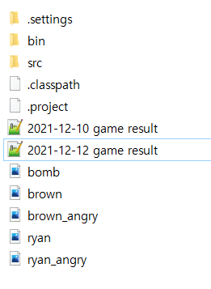

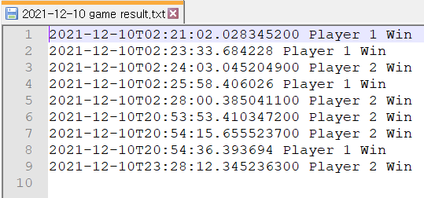

***

## Reference

https://binghedev.tistory.com/50?category=808256